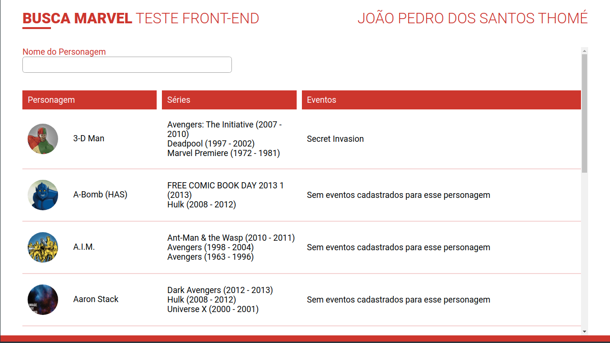
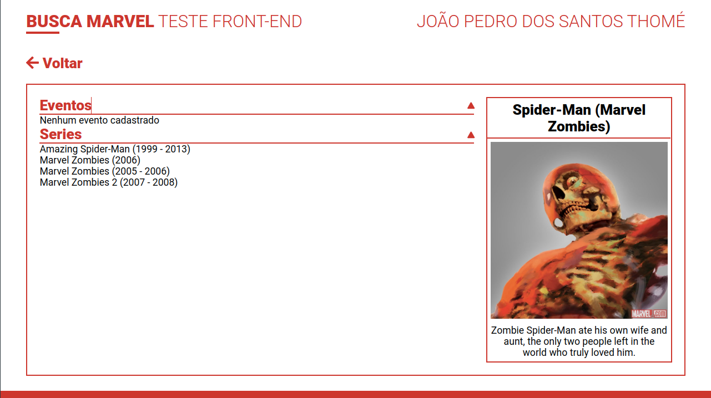

# BuscaMarvel

## Configurações necessárias para executar o Busca Marvel

Antes de iniciar a aplicação você precisa acessar a [API da Marvel](https://developer.marvel.com/) para adquirir uma chave da API para você, após isso basta adicionar as suas API Keys no arquivo `src/environments`

## Iniciando o projeto

Para iniciar o projeto execute `npm install` para instalar as dependências e após isso execute `ng serve`.

This project was generated with [Angular CLI](https://github.com/angular/angular-cli) version 12.1.1.
